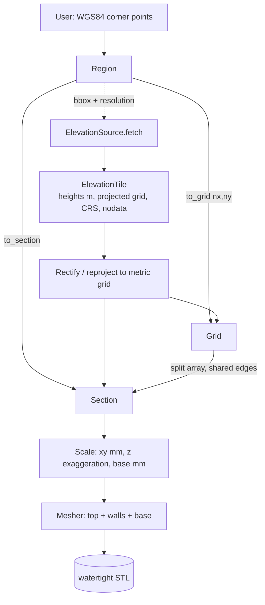
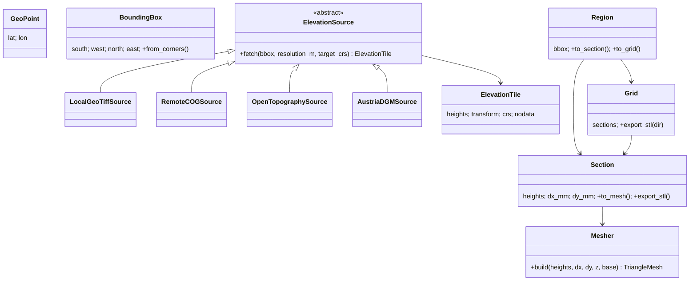

# geostl — Package Structure & Design Plan

## 1. Context

`geostl` turns public **elevation data (GeoTIFF/DEM)** into **3D‑printable terrain models (STL)**. A
user picks a rectangle on the earth in **WGS84** corner coordinates; the library fetches the height
data covering it, rectifies it to a metric grid, scales it to a print bed, and emits a watertight
STL. Two modes are required:

- **Single section** — one rectangle → one STL.
- **Tiled grid** — one large rectangle split into an `nx × ny` grid of sections whose printed parts
  fit together seamlessly.

Because different countries publish elevation data through different services, data access is hidden
behind a **source wrapper abstraction** so new countries/APIs are added without touching the meshing
pipeline.

### Where the code is today
- `scratchpad.ipynb` — prototype: local file → `geotiff.GeoTiff.read_box(bbox)` → numpy heights →
  geodesic meter grid (`geopy`) → 2D `pcolormesh`. Also an unconnected numpy‑stl cube demo.
- `meshing/mesher.py` — `Mesher.create_mesh(heightmap, dimensions)` stub, unimplemented.
- `crop_cog.py` — **source lost**; only `__pycache__/crop_cog.cpython-313.pyc` remains. It held a
  GDAL‑Warp crop+reproject helper (`crop_geotiff_to_numpy`, default CRS EPSG:4326). Worth recovering
  from git reflog or rewriting.
- No `pyproject.toml`, README, LICENSE, deps manifest, or `__init__.py` anywhere.

### Goals
1. Clean, testable library API (`Region → Section/Grid → STL`).
2. Pluggable data sources (Austria, global, local, remote COG).
3. Geometrically correct horizontal scaling (metric reprojection, not raw degrees).
4. Watertight, printable solids with a base, vertical exaggeration, and seam‑matched tiles.

### Non‑goals (initially)
Slicing/G‑code, texture/colour, non‑rectangular regions, GUI. **Tile connectors** — v1 emits plain
watertight solids; later, *pin holes* on tile edges/base for alignment pins (design accommodates it,
implementation deferred).

---

## 2. High‑level architecture



The **only** thing a country adapter must implement is `fetch(bbox) → ElevationTile`. Everything
downstream (rectify → scale → mesh → export) is source‑agnostic.



---

## 3. Package layout (src‑layout)

```
geostl/
├── pyproject.toml            # metadata, deps, optional extras, build backend
├── README.md
├── LICENSE
├── .gitignore                # add __pycache__/, *.stl, .venv/ ; keep *.tif
├── src/
│   └── geostl/
│       ├── __init__.py       # public API re-exports: Region, sources, Section, Grid
│       ├── geometry.py       # GeoPoint, BoundingBox, UTM/CRS selection helpers
│       ├── elevation.py      # ElevationTile dataclass (+ crop/subset helpers)
│       ├── rectify.py        # reproject-to-metric-grid + geodesic fallback
│       ├── tiling.py         # Region, Grid, array-splitting with shared edges
│       ├── scaling.py        # bed-fit, mm-per-meter, z exaggeration, base
│       ├── mesh.py           # Mesher: heights -> watertight TriangleMesh -> STL
│       ├── preview.py        # optional matplotlib 2D/3D preview (viz extra)
│       ├── cli.py            # optional `geostl` command (cli extra)
│       └── sources/
│           ├── __init__.py
│           ├── base.py       # ElevationSource ABC + ElevationTile contract
│           ├── local.py      # LocalGeoTiffSource (offline / current notebook path)
│           ├── cog.py        # RemoteCOGSource (/vsicurl/ streaming + warp)
│           ├── opentopography.py  # global DEM REST API (SRTM/Copernicus)
│           └── austria.py    # AustriaDGMSource (national DGM open data) — PRIMARY
├── tests/
│   ├── conftest.py           # SyntheticSource, tiny fixtures (no network)
│   ├── test_geometry.py
│   ├── test_tiling.py        # coverage + seam-matching invariants
│   ├── test_scaling.py
│   ├── test_mesh.py          # watertightness, triangle count, dimensions
│   └── test_sources.py       # adapters with mocked HTTP
├── examples/
│   └── austria_dgm.ipynb     # migrated + finished scratchpad
└── assets/                   # gitignored *.tif dev data (DGM_R25.tif)
```

Migration of current code: notebook cells 2–3 → `LocalGeoTiffSource` + `rectify.py`; cell 3 helpers
(`generate_rectified_coord_arrays`, `scale`) → `rectify.py`/`scaling.py`; the recovered
`crop_geotiff_to_numpy` → `sources/cog.py`; `meshing/mesher.py` → `src/geostl/mesh.py` (flesh out).

---

## 4. Core domain types

### `geometry.py`
```python
@dataclass(frozen=True)
class GeoPoint:      # WGS84
    lat: float
    lon: float

@dataclass(frozen=True)
class BoundingBox:   # WGS84, normalized so south<north, west<east
    south: float; west: float; north: float; east: float

    @classmethod
    def from_corners(cls, a: GeoPoint, b: GeoPoint) -> "BoundingBox": ...
    def centroid(self) -> GeoPoint: ...

def utm_epsg_for(bbox: BoundingBox) -> int:
    """Auto-pick the metric CRS for correct horizontal scale.
    zone = floor((lon+180)/6)+1; EPSG 326xx (N) / 327xx (S).
    e.g. Austria ~14°E,47°N -> UTM 33N -> EPSG:32633."""
```
Rationale: degrees are **not** equal in meters (a longitude degree shrinks with latitude), so the
horizontal grid must be built in a projected metric CRS. Auto‑UTM is the sane default; overridable
(e.g. national grids like MGI/Austria Lambert `EPSG:31287`).

### `elevation.py`
```python
@dataclass
class ElevationTile:
    heights: np.ndarray          # 2D float32, meters, row 0 = north
    transform: Affine            # pixel<->projected-meters mapping
    crs: str                     # e.g. "EPSG:32633"
    nodata: float | None
    def pixel_size_m(self) -> tuple[float, float]: ...
    def subset(self, row0, row1, col0, col1) -> "ElevationTile": ...  # tiling
```
This is the single hand‑off object between fetching and meshing. Heights are already in meters
(z), on a regular metric grid (x/y), so meshing needs no further geo knowledge.

---

## 5. Source wrapper abstraction (the extensibility point)

```python
# sources/base.py
class ElevationSource(ABC):
    @abstractmethod
    def fetch(self, bbox: BoundingBox, *,
              resolution_m: float | None = None,
              target_crs: str | None = None) -> ElevationTile:
        """Return heights covering `bbox`, warped to `target_crs`
        (default: auto-UTM) at ~`resolution_m` per pixel."""
```

An adapter's job (possibly): resolve which national tiles/endpoints cover `bbox` → download/stream →
mosaic → **crop + reproject to metric grid** → return `ElevationTile`. All of that stays inside the
adapter.

| Adapter | Source | Notes |
|---|---|---|
| `AustriaDGMSource()` | Austrian DGM open data | **PRIMARY / first target**; national grid (likely MGI/Austria Lambert `EPSG:31287` or ETRS89/UTM33N `EPSG:25833`); matches `DGM_R25.tif` |
| `LocalGeoTiffSource(path)` | local `.tif` | offline dev + tests; current notebook behavior; `rasterio` windowed read + warp |
| `RemoteCOGSource(url)` | any Cloud‑Optimized GeoTIFF | GDAL `/vsicurl/` streaming, no full download |
| `OpenTopographySource(api_key, dem="COP30")` | OpenTopography `globaldem` REST API | later; **global** SRTM/Copernicus; free key |

> **First research task (Austria):** pin down the DGM acquisition path — WCS/OGC coverage service vs.
> downloadable per‑state tiles vs. COG — plus its native CRS, resolution(s), and tiling scheme. The
> adapter resolves covering tiles → fetch → mosaic → warp‑to‑metric internally. `LocalGeoTiffSource`
> (fed `DGM_R25.tif`) de‑risks the entire downstream pipeline while that acquisition path is settled.

**Design rule for seam integrity:** for a `Grid`, fetch the **whole** region as *one* `ElevationTile`
and split the array (Section 7). Do **not** fetch each tile via separate warps — independent
resampling would create seam mismatches and inconsistent z.

---

## 6. Rectification / reprojection (`rectify.py`)

Primary path: reproject the DEM into a metric CRS at the warp step (via `rasterio.warp`), yielding a
regular grid whose pixel spacing already equals `resolution_m`. Meshing then treats it as a plain
`dx × dy` lattice.

Fallback (no‑GDAL, small areas): the notebook's `geopy.geodesic` linspace/meshgrid approach, kept
behind a flag. It's approximate and distorts over large boxes (as the prototype docstring already
warns), so it's the exception, not the default. This replaces the buggy `get_bBox_wgs_84` path noted
in the notebook.

---

## 7. Tiling & grid (`tiling.py`)

```python
class Region:
    def __init__(self, bbox: BoundingBox): ...
    @classmethod
    def from_corners(cls, a, b) -> "Region": ...
    def to_section(self, source, *, resolution_m=25, target_crs=None) -> "Section": ...
    def to_grid(self, source, *, nx, ny, resolution_m=25) -> "Grid": ...
```

`to_grid` algorithm (seam‑safe):
1. `tile = source.fetch(full_bbox, resolution_m)` — one warp for the whole region.
2. Compute **global** scaling params (z‑range, bed fit, base) once → shared across tiles.
3. Split `tile.heights` into `nx × ny` sub‑arrays where **adjacent tiles share their boundary row/
   column** (1‑pixel overlap). Shared edge ⇒ identical heights ⇒ prints butt together.
4. Emit `Section` per cell, labelled `(row, col)`.

Invariants asserted in tests: union of sub‑bboxes == region; neighbor edges are pixel‑identical;
every tile uses the same mm‑per‑meter and z‑exaggeration.

---

## 8. Scaling (`scaling.py`)

Parameters (resolved once per Section/Grid):
- `bed_size_mm` **or** `scale_xy` (mm per real meter) — horizontal footprint.
- `z_exaggeration` — vertical exaggeration (terrain relief is tiny vs. extent).
- `base_thickness_mm` — solid base below the lowest point → watertight, stable print.
- optional `max_model_height_mm` clamp.

For a `Grid`, scaling is computed from the **whole** region so all tiles share one scale and base
plane.

---

## 9. Meshing → STL (`mesh.py`)

Turn an `H×W` height lattice (with `dx_mm`, `dy_mm`, scaled `z_mm`) into a **watertight solid**:
- **Top surface**: `(H-1)(W-1)·2` triangles over the grid.
- **Side walls**: 4 edges dropped vertically to the base plane.
- **Bottom**: base plane, closing the solid.

Vectorized numpy construction (no Python per‑triangle loop — the prototype's double loops are too
slow), exported via `numpy-stl` (`stl.mesh.Mesh`). `trimesh` is an optional dependency used to
**assert manifold/watertight** in tests and optionally repair. This finally connects the two
disjoint halves of the notebook (terrain array ↔ STL).

```python
class Mesher:
    def build(self, heights_mm, dx_mm, dy_mm, base_z_mm) -> "TriangleMesh": ...
    # TriangleMesh.export_stl(path, binary=True)
```

**Future‑proofing for tile connectors:** keep base/wall generation parameterized so *pin holes* can
later be subtracted from tile edges (or the base) — e.g. a `connectors=PinHoles(diameter_mm=3, ...)`
option that carves cylindrical voids and re‑closes the mesh so pins can join tiles. Not built in v1,
but the wall/base code must not hard‑assume solid‑only edges.

---

## 10. Public API (target usage)

```python
from geostl import Region, GeoPoint
from geostl.sources import AustriaDGMSource   # or LocalGeoTiffSource("assets/DGM_R25.tif")

src = AustriaDGMSource()
region = Region.from_corners(GeoPoint(47.691855, 14.039583),
                             GeoPoint(47.723852, 14.089708))

# Single section
section = region.to_section(src, resolution_m=25)
section.scale(bed_size_mm=200, z_exaggeration=1.8, base_thickness_mm=3)
section.export_stl("terrain.stl")

# 3x3 tiled grid, seams matched, shared scale
grid = region.to_grid(src, nx=3, ny=3, resolution_m=25)
grid.scale(bed_size_mm=200, z_exaggeration=1.8, base_thickness_mm=3)
grid.export_stl("out/", prefix="tile")   # out/tile_r0_c0.stl ...
```

---

## 11. Dependencies & key library decisions

| Concern | Choice | Why |
|---|---|---|
| Raster IO + warp | **`rasterio`** (confirmed) | GDAL under the hood but pip‑installable **wheels** (critical on Windows, where `osgeo`/GDAL is painful); windowed reads, `rasterio.warp`, `/vsicurl/` COG streaming. Subsumes both `geotiff` and raw `osgeo`. |
| CRS math | `pyproj` | UTM auto‑selection, transforms (ships with rasterio). |
| STL export | **`numpy-stl`** | already used; simple, fast binary STL. |
| Mesh validation | `trimesh` (optional) | watertight/manifold checks, repair, alt formats. |
| HTTP | `requests` | REST adapters (OpenTopography, etc.). |
| Preview | `matplotlib` (optional `viz` extra) | keep the notebook's 2D/3D previews. |
| Geodesic fallback | `geopy` (optional) | only for the no‑GDAL rectify path. |

Extras: `pip install geostl[viz,cli,dev]`, plus per‑source extras if an adapter needs heavy deps.
Target **Python 3.11+** (artifacts show 3.13; 3.11 widens compatibility).

---

## 12. Repo hygiene (early cleanup)
- Add `pyproject.toml`, `README.md`, `LICENSE`, `src/geostl/__init__.py`.
- Recover `crop_cog.py` from git reflog if possible; else rewrite from the `.pyc` string contract.
- Remove the committed `__pycache__/crop_cog.cpython-313.pyc`; add `__pycache__/` to `.gitignore`.
- Keep `*.tif` ignored; add an `examples/` notebook replacing the root `scratchpad.ipynb`.

---

## 13. Testing strategy
- **No network in unit tests**: a `SyntheticSource` returns deterministic synthetic terrain (e.g. a
  gaussian hill) as an `ElevationTile`.
- `test_geometry` — bbox normalization, UTM/EPSG selection.
- `test_tiling` — sub‑bbox coverage, **seam pixel‑identity** between neighbors, shared scaling.
- `test_scaling` — mm‑per‑meter, exaggeration, base math.
- `test_mesh` — triangle counts, model bounding‑box dimensions, **watertight** via `trimesh`.
- `test_sources` — adapters against **mocked** HTTP (`responses`/`requests-mock`); one optional
  `@pytest.mark.network` smoke test.

---

## 14. Implementation roadmap

| Phase | Deliverable |
|---|---|
| 0 | Scaffolding: `pyproject.toml`, src‑layout, `__init__.py`, deps, repo cleanup |
| 1 | `geometry` + `ElevationTile` + `LocalGeoTiffSource` (reproduce notebook, packaged; stands in for Austria) |
| 2 | `rectify` — reproject to metric grid via `rasterio.warp` (+ geodesic fallback) |
| 3 | `mesh` — watertight STL for a **single** section, end‑to‑end |
| 4 | `scaling` — bed fit, z‑exaggeration, base |
| 5 | `tiling` — `Grid` with seam‑matched tiles + shared scale |
| 6 | **`AustriaDGMSource`** — primary public data source (acquisition + mosaic + warp) |
| 7 | `OpenTopographySource` (global) + `RemoteCOGSource` — additional APIs |
| 8 | CLI, examples notebook (finished `austria_dgm.ipynb`), README/docs |
| 9 | *(stretch)* tile connectors — **pin holes** for alignment pins |

---

## 15. Confirmed decisions
- **Output form:** watertight solid STL with a flat base. *Tile connectors (pin holes for alignment
  pins) are designed‑for but deferred* past v1.
- **Primary data source:** **Austria DGM** first (with `LocalGeoTiffSource` as the offline stand‑in
  during early phases); OpenTopography/global added later.
- **Raster library:** **`rasterio`** (wheels, Windows‑friendly), replacing the `osgeo`/`geotiff`
  approaches from the prototype.
